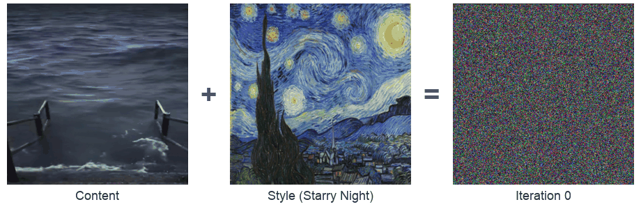
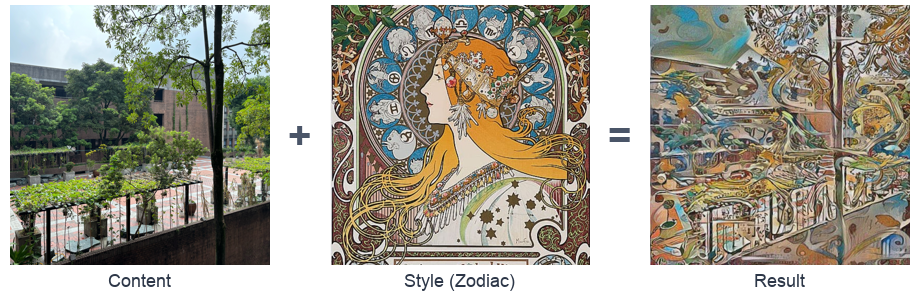
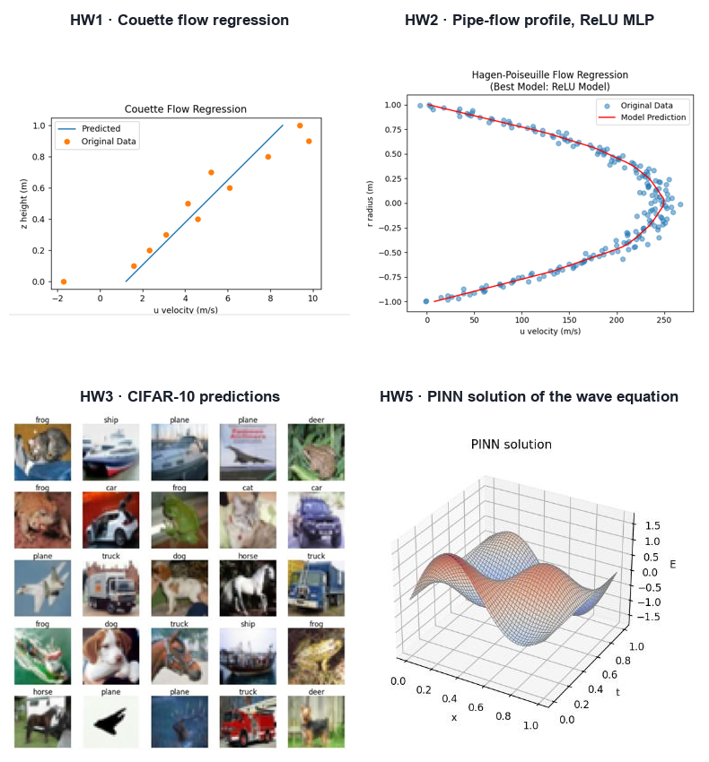

<div align="center">

# Deep Learning Coursework

Five graduate homework projects in PyTorch: regression on analytic fluid flows, a CNN on CIFAR-10, neural style transfer and a physics-informed neural network. Each task comes in three levels: basic, medium and advanced.



</div>

<details open>
<summary><b>English</b></summary>

## Results

**Neural style transfer (HW4).** VGG19 features, optimized with L-BFGS. The animation above shows the notebook run, and below is `dpl4_basic.py`:



**The other four assignments.** The figures are taken from each write-up:



## Projects

| # | Folder | Topic | Model |
|---|---|---|---|
| 1 | [`Couette Flow Regression`](Couette%20Flow%20Regression) | Fit linear Couette flow, with and without L2 regularization | Linear regression |
| 2 | [`Hagen-Poiseuille Flow`](Hagen-Poiseuille%20Flow) | Fit the parabolic pipe-flow profile, comparing base, wider, deeper and ReLU models | MLP |
| 3 | [`Convolution`](Convolution) | Classify CIFAR-10 images | 2-layer CNN vs MLP |
| 4 | [`Generative and Neural Style Transfer`](Generative%20and%20Neural%20Style%20Transfer) | Transfer an artwork's style onto photos | VGG19 features |
| 5 | [`PINN`](PINN) | Solve the 1D wave equation with a physics-informed loss | DeepXDE (PyTorch backend) |

Each folder holds `dplN_basic.py`, `dplN_med.py` and `dplN_adv.py`.

## Run

```bash
pip install torch torchvision matplotlib numpy tqdm deepxde
cd "Generative and Neural Style Transfer"
python dpl4_basic.py
```

Paths are resolved relative to each script. CIFAR-10 downloads automatically on the first run.

</details>

<details>
<summary><b>繁體中文</b></summary>

以 PyTorch 完成的五份研究所作業，主題包括解析流場迴歸、CIFAR-10 CNN、神經風格轉換，以及物理資訊神經網路（PINN）。每份作業都分為 basic、medium、advanced 三個難度。

## 成果

**神經風格轉換（HW4）**：使用 VGG19 特徵，以 L-BFGS 最佳化。上方動畫是 notebook 的執行過程，下圖是 `dpl4_basic.py` 的結果：


**其他四份作業**：圖片取自各份書面報告。


## 作業列表

| # | 資料夾 | 主題 | 模型 |
|---|---|---|---|
| 1 | [`Couette Flow Regression`](Couette%20Flow%20Regression) | 擬合線性 Couette 流，比較有無 L2 正則化 | 線性迴歸 |
| 2 | [`Hagen-Poiseuille Flow`](Hagen-Poiseuille%20Flow) | 擬合圓管流的拋物線速度剖面，比較基本、加寬、加深與 ReLU 模型 | MLP |
| 3 | [`Convolution`](Convolution) | CIFAR-10 影像分類 | 2 層 CNN 與 MLP 比較 |
| 4 | [`Generative and Neural Style Transfer`](Generative%20and%20Neural%20Style%20Transfer) | 把畫作的風格套用到照片上 | VGG19 特徵 |
| 5 | [`PINN`](PINN) | 以物理資訊損失函數求解一維波動方程 | DeepXDE（PyTorch 後端） |

每個資料夾內都有 `dplN_basic.py`、`dplN_med.py`、`dplN_adv.py`。

## 執行

```bash
pip install torch torchvision matplotlib numpy tqdm deepxde
cd "Generative and Neural Style Transfer"
python dpl4_basic.py
```

路徑都以程式所在位置為基準。第一次執行時會自動下載 CIFAR-10。

</details>
